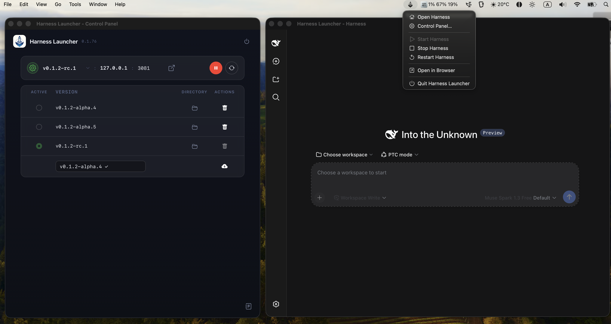

# DeepSeek Harness Launcher

<p align="center">
  
</p>

<h3 align="center">
  Run, manage and version the DeepSeek Harness engine — no browser, no terminal, no fuss.
</h3>

<p align="center">
  
  <a href="https://tauri.app"></a>
  
  
</p>

---

**DeepSeek Harness Launcher** is a polished macOS menubar app that wraps the
DeepSeek Harness (`dsh`) engine in a self-contained Tauri shell. It
encapsulates all the complexity of running an AI harness engine: install,
update, switch versions, start, stop — everything a harness developer needs,
without ever touching a terminal or keeping a browser tab open.

> **The engine runs in the background.** The launcher installs and manages the
> harness inside the app (bundled Node runtime + vendored npm), serves the
> harness WebUI on `http://127.0.0.1:<port>`, and gives you a native menubar
> presence for the full lifecycle. Close the window — the engine keeps serving.

## ✨ Features

| | |
|---|---|
| 🚀 **Engine lifecycle** | Start / Stop / Restart the background harness right from the menu bar, the Control Panel window, or (Start only) the floating in-page panel. |
| 📦 **Version management** | Install & switch between any published engine version with one click — the **Active** radio in the versions table picks the running version, **update to latest** and **roll back** to the previously installed version are one button each. Every version lives in its own isolated install, offline-safe. |
| 🖥️ **Live download terminal** | While a version is downloading you see the real `npm install` output in a terminal view — each in-flight operation gets its own terminal, streams live, and dismisses itself when done (no manual cleanup, no dead controls). |
| 🗑️ **Delete versions** | Remove installed engine versions you no longer need (the active version is protected by a confirmation popover). |
| 🌐 **Choose your port** | Set any loopback port — the harness restarts on it and the window follows automatically, with transparent fallback if the port is busy. |
| 🔔 **Update checks** | Manual harness update checks from the panel or menubar ("Check now"); no background polling, no silent installs (optional app self-update via the Tauri updater). |
| 📋 **Logs** | Follow the live harness log tail straight from the Control Panel (toggleable bottom drawer). |
| 🧰 **No browser needed** | The harness WebUI opens in its own app window; “Open in Browser” is available when you *do* want a tab. |

## 🖼️ What it looks like

<p align="center">
  
</p>
<p align="center">
  <sub>The Control Panel: engine card (version · host · port), update banner, the versions table (<b>Active</b> radio, open-directory, delete) with the install row last, and a live operation terminal below.</sub>
</p>

The **Control Panel** (menu bar → `Control Panel…`) aggregates engine status,
version management, downloads with live terminal output, port configuration,
update checks and logs. The **floating panel** in the bottom-left of the harness
UI shows live status without leaving your chat; mutating actions live in the
Control Panel (the harness page is untrusted, so its window is intentionally
read-only).

## 🚀 Quick start

### From a release build

```bash
cd source
npm install                # installs @tauri-apps/cli
npm run assets             # icons + bundled Node sidecar + vendored npm (network once)
npm run build              # tauri build → src-tauri/target/release/bundle/macos/DeepSeek Harness Launcher.app
```

### Manual deploy to /Applications

```bash
npm run deploy             # build release + install into /Applications
npm run deploy:relaunch    # build, install, then restart the running instance
```

### Day-to-day use

1. Launch **DeepSeek Harness Launcher** — it's a menubar app (no Dock icon).
2. On first launch it installs the latest engine version in the background.
3. The engine starts and the harness UI opens in its own window.
4. Use the **Control Panel** to start/stop, switch versions, watch downloads
   and change the port (the floating **DSh panel** shows status and starts a
   stopped engine).

## 🔒 Security & privacy

- **Loopback only.** The engine and the launcher UI are served on
  `127.0.0.1` — nothing is exposed to the network by the launcher.
- **No telemetry.** The launcher collects nothing and phones nothing home;
  all state stays under `~/Library/Application Support/ai.dsh.launcher/`.
- **Capability-gated IPC.** The WebViews reach the Rust core through a Tauri
  capability file with an explicit allow-list; harness-served content is
  treated as untrusted.
- Found a vulnerability? Please see [SECURITY.md](SECURITY.md) — do not open
  a public issue for security problems.

## 🔧 How it works

A *thin, replaceable shell*: the harness engine (`@deepseek-ai/dsh`) is
installed, updated, versioned and rolled back **inside** the app with a
bundled Node runtime and vendored npm. The Tauri binary never needs rebuilding
when the engine releases a new version — updates happen at the click of a
button. Redeploying or updating the launcher never touches your installed
engine versions, settings or logs.

```
~/Library/Application Support/ai.dsh.launcher/
├── settings.json          # port, start_on_launch, active/previous version
├── logs/launcher.log      # launcher events (rotated @ 1MB)
└── runtime/
    ├── versions/<version>/   # one isolated npm install per engine version
    ├── logs/harness.log      # harness stdout/stderr (rotated @ 2MB)
    └── npm-cache/            # npm cache for the vendored npm
```

## 🧑‍💻 Development

```bash
cd source
npm run assets
npx tauri dev              # or: cargo run --manifest-path src-tauri/Cargo.toml
npm test                   # panel/feed integration checks (scripts/test-panel-feed.mjs)
cd src-tauri && cargo test # Rust unit tests
```

Prerequisites: **macOS 11 or later (Apple Silicon)**, Rust stable, Xcode
Command Line Tools, Node.js 20+ (build-time only — the app is fully
self-contained at runtime).

## 🏗️ Architecture

- `src-tauri/src/runtime.rs` — harness process lifecycle (spawn / stop /
  restart / supervise, phase tracking, log capture)
- `src-tauri/src/versions.rs` — npm version listing, install, rollback
- `src-tauri/src/progress.rs` — `launcher://progress` / `launcher://console`
  event streams + in-flight operation state
- `src-tauri/src/commands.rs` — IPC surface for the overlay, Control Panel
  and tray (status, install/switch, download, update, rollback, delete,
  port, logs, window and quit controls)
- `src-tauri/src/window.rs` — harness window (+ injected overlay panel) and
  Control Panel window (`dsh-ui://` custom protocol)
- `src-tauri/resources/settings.html` / `stopped.html` / `overlay.js` —
  Control Panel, engine-stopped page and in-page control panel

## 📜 License

MIT — see [LICENSE](LICENSE). The harness engine itself is a separate
MIT-licensed project.
